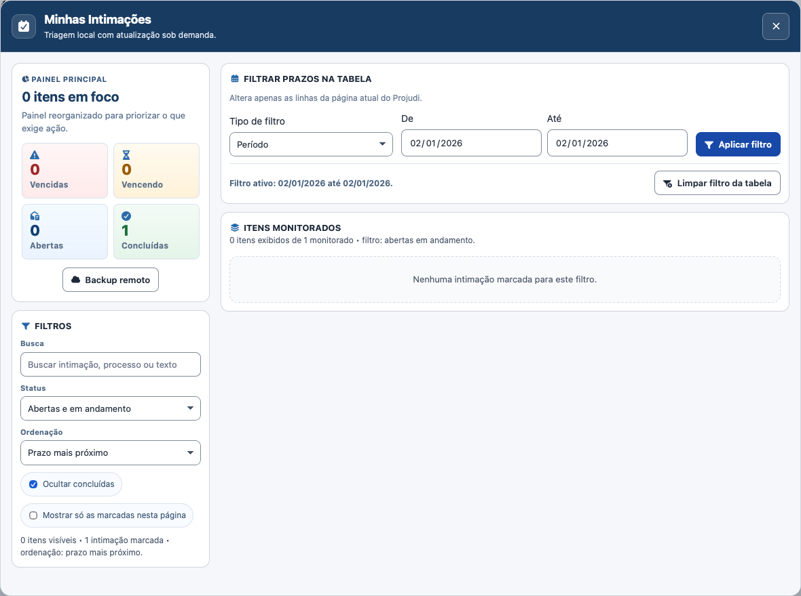
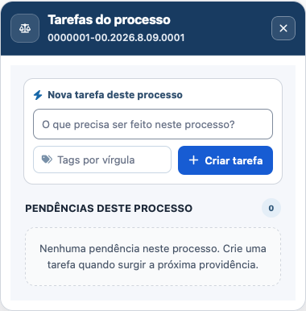
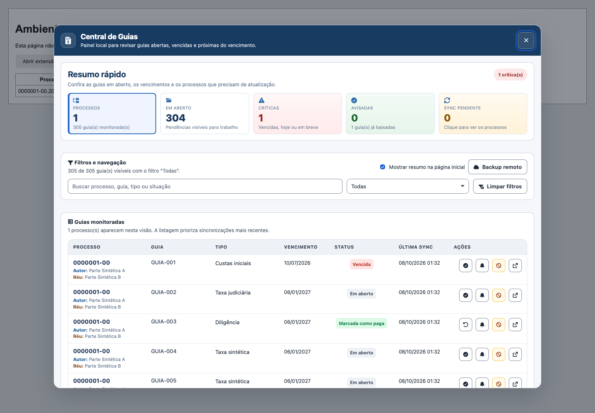

# Ajustes dos cinco prints — 08/10/2026

As fontes foram corrigidas a partir dos prints e da inspeção da sessão autenticada do Projudi no Safari. O wBlock não foi aberto nem alterado nesta rodada. As novas fontes não foram carregadas na sessão pessoal; as verificações das correções usam páginas fictícias em navegadores descartáveis. A pasta `arquivo/` permaneceu fora do escopo.

## Correções por print

| Print | Extensão | Correção |
| --- | --- | --- |
| 1 | Central de Guias | Opção **Mostrar resumo na página inicial**, em **Filtros e navegação** do gerenciador. Desmarcar remove o cartão e o aviso persistente inicial já aberto; marcar reativa o resumo. Preferência persistida no navegador e sincronizada entre documentos da mesma origem. |
| 2 | Intimações | Um seletor para **Data exata**, **Período** ou **Sem data limite**, somente os campos correspondentes e uma ação **Aplicar filtro**. **Limpar filtro da tabela** fica no rodapé comum, junto ao estado ativo. Limpeza restaura linhas e datas; intervalos invertidos não são aplicados. |
| 3 | Anotações e Tarefas | Atalhos acompanham cor e tamanho do ícone nativo, em posições normais do fluxo e com margens uniformes. Removidos os cálculos independentes de tamanho e espaçamento que produziam diferenças e sobreposição. Indicadores de conteúdo permanecem ancorados ao próprio botão. |
| 4 | Customizações | Ícone de espelho PDF usa cor e escala do PDF nativo. A barra ganha alinhamento central e distância uniforme de 8 px entre botões. Desativar o recurso remove o botão e os ajustes da barra. |
| 5 | Tarefas | Janela do processo limitada a 380 px, altura automática, cabeçalho compacto e mensagem vazia sem altura mínima excessiva. Texto de tags encurtado para evitar truncamento. Rolagem interna preservada para conteúdo maior. |

A coluna direita de Intimações também passou a agrupar filtro e lista, evitando que a altura da coluna lateral crie um espaço vazio entre eles. Busca/status continuam aplicados aos itens monitorados; prazos filtram a tabela da página atual do Projudi.

## Organização das fontes

- `ui/suite-ui.js`: helper compartilhado para acompanhar controles nativos, incorporado nas cinco IIFEs.
- `ui/suite-ui.css`: regras de atalhos, barra de ações e janela compacta.
- Metadados `.meta.js` sincronizados; quatro fontes com versão `2026.10.08-01:31`, Central de Guias com `2026.10.08-01:32`.
- READMEs de Central de Guias, Intimações e Tarefas atualizados.
- Fixture de processo com ações flutuadas à direita; verificações de datas, limpeza, cores, dimensões, preferência e reversão adicionadas ao QA existente.

## Validação executada

| Verificação | Resultado |
| --- | --- |
| Contratos | 27 aprovados, zero falhas |
| Sintaxe dos cinco userscripts e sincronização do núcleo/metadados | Aprovadas |
| WebKit, cinco extensões nas larguras 1440/1180/900/768/390 | 25 cenários aprovados |
| Chromium, mesmas extensões/larguras | 25 cenários aprovados |
| WebKit, ícones offline, altura 650 px, larguras 1180/768/390 | 15 cenários aprovados |
| Interações com top/iframe no WebKit | 17 verificações aprovadas, zero erros de execução |
| Interações com top/iframe no Chromium | 17 verificações aprovadas, zero erros de execução |
| `git diff --check` | Aprovado |

As interações incluem coexistência dos cinco scripts, atalhos A/G/C/I/T, Escape/foco, filtros da tabela no iframe, salvamento e reordenação de dados fictícios, painel de arquivos, preferência do resumo, alertas iniciais e reversão da barra PDF. As requisições são interceptadas; nenhuma guia, tarefa, anotação, arquivo ou Gist real é alterado pelo QA.

Relatórios JSON e hashes das fontes estão em [evidencias](evidencias/). WebKit automatizado confirma comportamento no motor, mas não substitui a validação da nova versão instalada no Safari com wBlock.

## Imagens sintéticas das correções








## Reproduzir

Com Playwright e os navegadores de teste já disponíveis:

```sh
node scripts/sync-suite-ui.mjs --check
node scripts/sync-metadata.mjs --check
node --test tests/suite-contract.test.mjs
node scripts/qa-browser.mjs --populated
node scripts/qa-interactions.mjs
```

Definir `PROJUDI_PLAYWRIGHT_MODULE`, `PROJUDI_QA_BROWSER`, `PROJUDI_QA_EXECUTABLE` e `PROJUDI_QA_OUTPUT` conforme a instalação local. Para offline/telas baixas, usar `PROJUDI_QA_HEIGHT=650`, `PROJUDI_QA_WIDTHS=1180,768,390` e `node scripts/qa-browser.mjs --offline-icons`. `PROJUDI_QA_SPRITE` aponta ao sprite local de teste. As imagens aqui são fictícias; os prints privados do usuário não foram copiados para o repositório.
